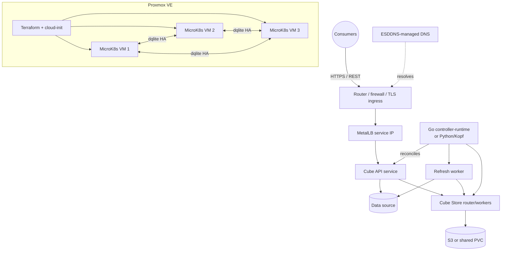
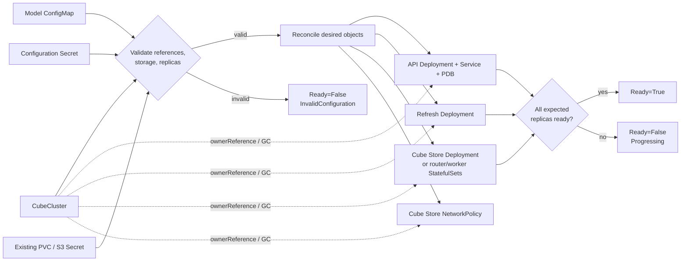
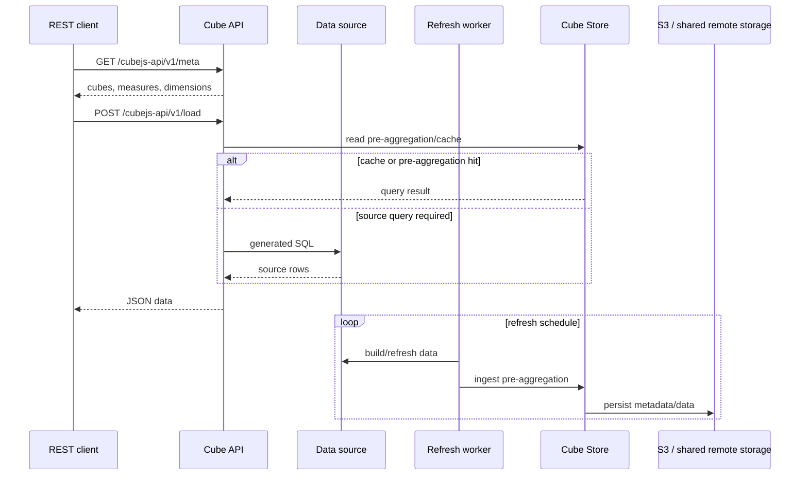
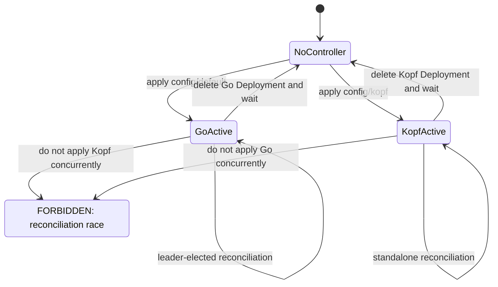
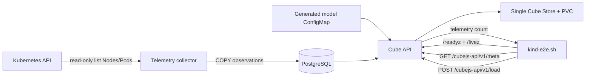
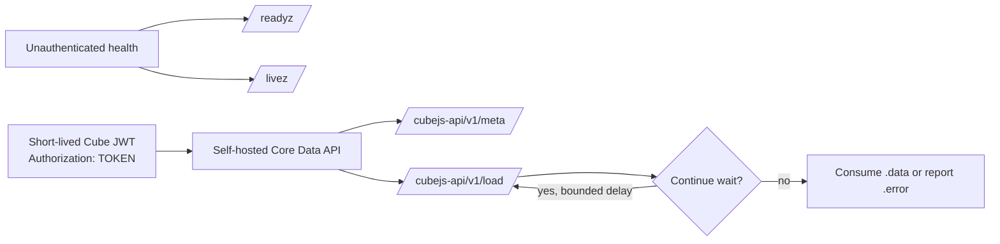
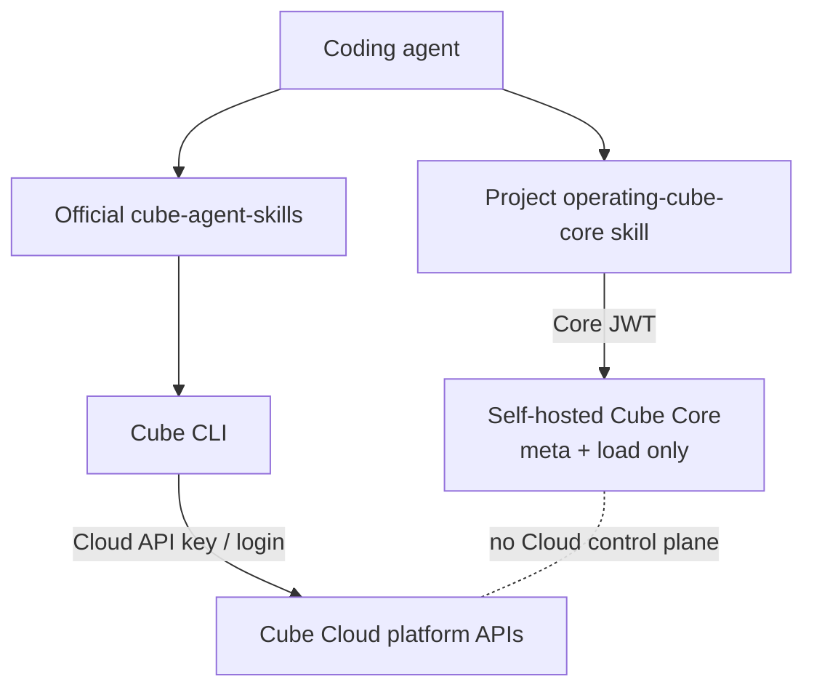
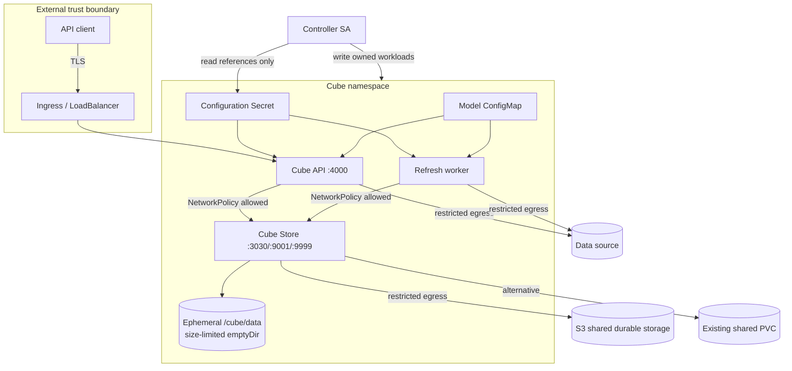

# Cube Core MicroK8s Operator

A production-oriented Kubernetes operator for self-hosted Cube Core, with
Proxmox/MicroK8s infrastructure, selectable Go and Kopf controllers, and a
reproducible Kind telemetry demo. Go/controller-runtime is the default
production implementation. The Python/Kopf implementation is a separately
packaged, single-replica alternative for the same `CubeCluster` CRD.

> **One controller only:** never run the Go and Kopf controllers against the
> same cluster or resource at the same time. They own identical resources and
> status fields, so concurrent operation causes reconciliation races.

The API is `platform.cube.dev/v1alpha1`; test upgrades and recovery procedures
before production use.

## Contents

- [System architecture](#system-architecture)
- [Build and verify](#build-and-verify)
- [Deploy or switch controllers](#deploy-or-switch-controllers)
- [Configure Cube Core](#configure-cube-core)
- [Kind telemetry demo](#kind-telemetry-demo)
- [Use the Cube Core REST API](#use-the-cube-core-rest-api)
- [Agent integrations](#agent-integrations)
- [Storage, network, and security](#storage-network-and-security)
- [Publish through OperatorHub and OLM](#publish-through-operatorhub-and-olm)
- [Troubleshooting](#troubleshooting)
- [Production checklist](#production-checklist)

Deeper references: [architecture and operations](docs/architecture.md),
[agent integration boundary](docs/agent-integration.md), and the
[production custom resource](config/samples/production.yaml).

## System architecture

### Proxmox, MicroK8s, operator, and Cube

Terraform preserves the original Proxmox/MicroK8s infrastructure boundary.
Application deployment remains a separate Kubernetes lifecycle.



MetalLB provides LAN reachability, not automatic public exposure. DNS, edge
port forwarding, ingress, certificates, and firewall policy remain explicit
operator responsibilities.

### Reconciliation and ownership

Both controller implementations enforce the same desired topology and owner
references. The Ready condition requires API, refresh worker, and Cube Store
replicas to be ready.



### Cube query and refresh data flow



## Build and verify

Prerequisites:

- Go 1.24+, Python 3, Kustomize, and Terraform 1.7+.
- Docker, Kind, kubectl, curl, and jq for the demo.
- Either an amd64 or Apple Silicon arm64 Docker host. `kind-up.sh` detects the
  Kind node architecture and selects the matching digest-pinned Cube Store
  image (`v1.7.20` for amd64, `arm64v8` for arm64).

```bash
make verify                 # Go tests/vet, Python tests, manifests, TF, shellcheck
make build                  # Go production-default binary
make test                   # Go and focused Kopf resource tests
make manifests-go           # render default Go installation
make manifests-kopf         # render optional Kopf installation

docker build -t cube-operator:v0.1.0 .
docker build -f python/Dockerfile -t cube-operator-kopf:v0.1.0 .
```

All upstream runtime images are versioned and digest-pinned. Local operator
tags identify builds from this tree; publish them to a trusted registry and set
the corresponding Kustomize image before deploying outside Kind.

## Deploy or switch controllers

### Deploy Go (default)

Set the registry image in an overlay or update `config/default/kustomization.yaml`,
then render and review before applying:

```bash
kustomize build config/default > /tmp/cube-operator-go.yaml
kubectl apply --server-side --dry-run=server -f /tmp/cube-operator-go.yaml
kubectl apply -f /tmp/cube-operator-go.yaml
kubectl -n cube-system rollout status deployment/cube-operator
```

The Go manager uses Kubernetes Lease leader election and is the recommended
production path.

### Deploy Kopf instead

First stop the Go manager; wait for deletion before creating Kopf:

```bash
kubectl -n cube-system delete deployment cube-operator --ignore-not-found --wait=true
kustomize build config/kopf > /tmp/cube-operator-kopf.yaml
kubectl apply --server-side --dry-run=server -f /tmp/cube-operator-kopf.yaml
kubectl apply -f /tmp/cube-operator-kopf.yaml
kubectl -n cube-system rollout status deployment/cube-operator-kopf
```

Kopf runs one replica with `--standalone`. It does not provide the Go manager's
multi-replica leader-election path.

### Switch safely back to Go

```bash
kubectl -n cube-system delete deployment cube-operator-kopf --ignore-not-found --wait=true
kubectl apply -f /tmp/cube-operator-go.yaml
kubectl -n cube-system rollout status deployment/cube-operator
kubectl -n cube-system get deploy cube-operator cube-operator-kopf --ignore-not-found
```



## Configure Cube Core

### Namespace, model, and configuration Secret

The operator reads references but never creates credentials. The following
creates a minimal PostgreSQL configuration without committing a Secret:

```bash
kubectl create namespace cube --dry-run=client -o yaml | kubectl apply -f -
kubectl -n cube create configmap cube-model \
  --from-file=KubernetesTelemetry.yml=demo/kind/model/KubernetesTelemetry.yml \
  --dry-run=client -o yaml | kubectl apply -f -

read -rsp 'Database password: ' CUBE_DB_PASS; echo
read -rsp 'Cube API signing secret: ' CUBE_API_SECRET; echo
kubectl -n cube create secret generic cube-configuration \
  --from-literal=CUBEJS_DB_TYPE=postgres \
  --from-literal=CUBEJS_DB_HOST=postgres.example.internal \
  --from-literal=CUBEJS_DB_PORT=5432 \
  --from-literal=CUBEJS_DB_NAME=analytics \
  --from-literal=CUBEJS_DB_USER=cube \
  --from-literal=CUBEJS_DB_PASS="$CUBE_DB_PASS" \
  --from-literal=CUBEJS_API_SECRET="$CUBE_API_SECRET" \
  --dry-run=client -o yaml | kubectl apply -f -
unset CUBE_DB_PASS CUBE_API_SECRET
```

Use External Secrets, Sealed Secrets, or your platform's secret manager in
production. Do not put values in Git, shell history, Terraform variables, or
shared state.

### Production S3 example

Prefer workload identity when available. If static S3 credentials are required,
create the referenced Secret out of band:

```bash
kubectl -n cube create secret generic cubestore-s3 \
  --from-literal=CUBESTORE_AWS_ACCESS_KEY_ID="$AWS_ACCESS_KEY_ID" \
  --from-literal=CUBESTORE_AWS_SECRET_ACCESS_KEY="$AWS_SECRET_ACCESS_KEY" \
  --dry-run=client -o yaml | kubectl apply -f -
```

```yaml
apiVersion: platform.cube.dev/v1alpha1
kind: CubeCluster
metadata: {name: analytics, namespace: cube}
spec:
  image: cubejs/cube:v1.7.20@sha256:7f14f4be9f3303afe48a16584480c8a9dc15f44c13daf66c2a5b31019025b71a
  modelConfigMap: cube-model
  configurationSecret: cube-configuration
  api: {replicas: 2}
  refreshWorker: {replicas: 1}
  cubeStore:
    mode: clustered
    image: cubejs/cubestore:v1.7.20@sha256:cd5fe68049204640704a6412a39e7a09eb391fc70890577dd21b5480d85cb219
    workers: 2
    remoteStorage:
      type: s3
      s3: {bucket: company-cube-prod, region: us-west-2, secretRef: cubestore-s3}
    scratch: {size: 100Gi}
  service: {type: LoadBalancer}
```

Tune resources from observed workload usage; the fuller starting point is
[`config/samples/production.yaml`](config/samples/production.yaml).

### Existing PVC example

PVC remote storage is most appropriate for a single Cube Store. A clustered
topology requires a genuinely shared, concurrently mountable filesystem; a
node-local or ordinary `ReadWriteOnce` claim is not sufficient.

```yaml
apiVersion: v1
kind: PersistentVolumeClaim
metadata: {name: cubestore-remote, namespace: cube}
spec:
  accessModes: [ReadWriteOnce]
  storageClassName: durable-block
  resources: {requests: {storage: 100Gi}}
---
apiVersion: platform.cube.dev/v1alpha1
kind: CubeCluster
metadata: {name: analytics, namespace: cube}
spec:
  modelConfigMap: cube-model
  configurationSecret: cube-configuration
  api: {replicas: 2}
  refreshWorker: {replicas: 1}
  cubeStore:
    mode: single
    remoteStorage:
      type: persistentVolume
      persistentVolume: {existingClaim: cubestore-remote}
    scratch: {size: 20Gi}
  service: {type: ClusterIP}
```

## Kind telemetry demo

The disposable demo samples Kubernetes Nodes and Pods, writes observations to
PostgreSQL, and queries them through Cube Core.



Scripts always pass the `kind-cube-demo` context, generate credentials in
Kubernetes Secrets, reuse an existing cluster safely, and select an amd64 or
arm64 digest based on `.status.nodeInfo.architecture`.

```bash
make kind-up              # Go controller (default)
make kind-e2e
make kind-down

make kind-up-kopf         # same demo, Kopf controller
make kind-e2e
make kind-down
```

`kind-e2e` verifies `/readyz`, `/livez`, `/cubejs-api/v1/meta`, and
`POST /cubejs-api/v1/load`, including bounded retries for `Continue wait`.
Port 4000 is bound locally for the lifetime of the Kind cluster.

## Use the Cube Core REST API

Health endpoints are unprefixed and unauthenticated. Core Data API calls use a
Cube JWT directly in `Authorization`—there is no `Bearer` prefix.

```bash
kubectl -n cube port-forward service/analytics-api 4000:4000
# In another shell:
export CUBE_CORE_URL=http://127.0.0.1:4000
curl --fail --silent "$CUBE_CORE_URL/readyz" | jq .
curl --fail --silent "$CUBE_CORE_URL/livez" | jq .
```

For this example, mint a five-minute HS256 JWT from the Kubernetes Secret. Avoid
putting production secrets or tokens on command lines or in logs:

```bash
API_SECRET=$(kubectl -n cube get secret cube-configuration \
  -o 'go-template={{index .data "CUBEJS_API_SECRET" | base64decode}}')
export CUBE_CORE_TOKEN=$(CUBE_API_SECRET="$API_SECRET" python3 <<'PY'
import base64, hashlib, hmac, json, os, time
enc = lambda b: base64.urlsafe_b64encode(b).rstrip(b"=")
head = enc(json.dumps({"alg":"HS256","typ":"JWT"}, separators=(",", ":")).encode())
body = enc(json.dumps({"iat":int(time.time()),"exp":int(time.time())+300}, separators=(",", ":")).encode())
signed = head + b"." + body
print((signed + b"." + enc(hmac.new(os.environ["CUBE_API_SECRET"].encode(), signed, hashlib.sha256).digest())).decode())
PY
)
unset API_SECRET
```

Inspect metadata, then query only member names returned by metadata:

```bash
curl --fail --silent --show-error --max-time 30 \
  -H "Authorization: $CUBE_CORE_TOKEN" \
  "$CUBE_CORE_URL/cubejs-api/v1/meta" | jq '.cubes[].name'

curl --fail --silent --show-error --max-time 95 \
  -H "Authorization: $CUBE_CORE_TOKEN" \
  -H 'Content-Type: application/json' \
  --data '{"query":{"measures":["KubernetesTelemetry.count"],"limit":10}}' \
  "$CUBE_CORE_URL/cubejs-api/v1/load" | jq .

unset CUBE_CORE_TOKEN
```

### REST operational contract



## Agent integrations

### Local self-hosted Cube Core skill

The project-local
[`operating-cube-core` skill](.agents/skills/operating-cube-core/SKILL.md)
uses only the self-hosted Core Data REST API. Provide `CUBE_CORE_URL` and a
short-lived `CUBE_CORE_TOKEN`, then use prompts such as:

- “Use operating-cube-core to verify readiness and list available cubes.”
- “Inspect metadata first, then query Kubernetes telemetry counts by namespace.”
- “Diagnose this `Continue wait` response with bounded retries; do not print my token.”

It intentionally cannot deploy Cube, edit model files, administer users, or
manage Cube Cloud content.

### Optional official Cube Cloud skills

The official [`cube-js/cube-agent-skills`](https://github.com/cube-js/cube-agent-skills)
drive the current `cube` CLI and Cube Cloud platform APIs. They **do not operate
local Cube Core**. Use them only for a separate Cube Cloud tenant:

```bash
# Agent Skills-compatible clients; review upstream instructions before install.
npx skills add cube-js/cube-agent-skills

# Install the official Cube CLI, optionally pinning CUBE_VERSION in automation.
curl -fsSL https://raw.githubusercontent.com/cube-js/cube/master/install-cli.sh | sh
cube login --url https://TENANT.cubecloud.dev

# Headless Cloud alternative:
export CUBE_API_URL=https://TENANT.cubecloud.dev
export CUBE_API_KEY='sk-...'
cube deployments list
```

Do not point `CUBE_API_URL` at the local service expecting Cloud control-plane
operations.



See [agent integration](docs/agent-integration.md) for the exact boundary.

## Storage, network, and security



- Cube Store has no external Service. Its ingress NetworkPolicy allows only
  pods belonging to the same Cube instance.
- Scratch space is ephemeral `emptyDir`; `scratch.size` is a limit, not durable
  capacity or a reservation.
- The operator does not provision, encrypt, or back up remote storage.
- Containers use RuntimeDefault seccomp, drop capabilities, and disable
  privilege escalation where compatible. Add admission policy and image
  verification for your environment.
- Add default-deny egress with explicit DNS, database, S3, and monitoring
  destinations; terminate TLS at a controlled ingress.
- RBAC permits writes to owned workload kinds, reads of referenced
  ConfigMaps/Secrets/PVCs, events, and Leases for Go leader election.

## Proxmox and MicroK8s

```bash
cp terraform.tfvars.example terraform.tfvars
export TF_VAR_proxmox_api_token='terraform@pve!cube=REPLACE_ME'
terraform init
terraform validate
terraform plan -out=tfplan
terraform apply tfplan

export SSH_PRIVATE_KEY="$HOME/.ssh/id_ed25519"
export METALLB_ADDRESS_POOL="192.168.1.200-192.168.1.220"
./scripts/bootstrap-microk8s.sh
export KUBECONFIG="$PWD/kubeconfig"
kubectl get nodes -o wide
```

Bootstrap waits for cloud-init, joins missing nodes, enables DNS, hostpath
storage, Helm and optional MetalLB, then writes a mode-0600 kubeconfig. Three
nodes enable MicroK8s HA. VM deletion protection defaults on. Before deliberate
destruction, back up data, set `protect_vms=false`, apply, and review a destroy
plan. Hostpath volumes are not durable across node loss.

## Publish through OperatorHub and OLM

This project is **not currently published on OperatorHub**. An OLM release
should package the production-default Go controller; Kopf remains a separately
selected deployment, not a second controller in the same installation.

For each release, use Operator SDK's bundle workflow to generate a CSV and CRD
bundle from `config/`, then review rather than blindly accepting generated
metadata:

```bash
operator-sdk generate kustomize manifests -q
make bundle IMG=ghcr.io/ORG/cube-operator:vX.Y.Z VERSION=X.Y.Z \
  CHANNELS=stable DEFAULT_CHANNEL=stable
operator-sdk bundle validate ./bundle
operator-sdk scorecard ./bundle
docker build -f bundle.Dockerfile -t ghcr.io/ORG/cube-operator-bundle:vX.Y.Z .
```

The CSV must include accurate `alm-examples`, `categories`, `capabilities`,
`containerImage`, description, repository/support links, provider and named
maintainers; add a base64 SVG or PNG `icon` with the matching media type.
Declare only install modes actually tested (`AllNamespaces` is the intended Go
manager mode), and keep owned CRD versions, permissions, image digests, channels,
upgrade graph, and replacement metadata consistent.

Push the signed controller and bundle images to a public immutable registry,
record digests, generate SBOM/provenance, and verify signatures in CI. Test the
published bundle on a clean Kind cluster with OLM before submission:

```bash
kind create cluster --name cube-olm
operator-sdk olm install
docker push ghcr.io/ORG/cube-operator:vX.Y.Z
docker push ghcr.io/ORG/cube-operator-bundle:vX.Y.Z
operator-sdk run bundle ghcr.io/ORG/cube-operator-bundle:vX.Y.Z --timeout 10m
kubectl get csv -A
kubectl apply -f config/samples/production.yaml
operator-sdk cleanup cube-microk8s-operator
kind delete cluster --name cube-olm
```

For catalog testing, build and push a file-based catalog with `opm init`,
`opm render`, `opm validate`, and `opm generate dockerfile`, then install a
`CatalogSource` and `Subscription` on the same clean Kind/OLM environment.
Finally fork the appropriate
[`k8s-operatorhub/community-operators`](https://github.com/k8s-operatorhub/community-operators)
repository, add the validated version under its package directory, run that
repository's required tests, and submit a PR with release and test evidence.
Publication occurs only after the community review and merge.

## Troubleshooting

| Symptom | Checks and corrective action |
|---|---|
| `Ready=False, InvalidConfiguration` | Run `kubectl describe cubecluster -n NAMESPACE NAME`; verify the model ConfigMap, configuration Secret, PVC/S3 fields, replica counts, and scratch quantity. |
| `Ready=False, Progressing` | Inspect the condition message, then `kubectl get pods -n NAMESPACE` and logs for API, refresh, and Cube Store. Every component must be ready. |
| API probe fails | Call `/readyz` and `/livez`; readiness includes the default data-source connection. Verify Secret values, DNS, NetworkPolicy, and database TLS. |
| Cube Store worker never becomes ready | Workers are probed on TCP 9001; routers/single stores on 3030. Check selected image architecture and Cube Store environment. |
| `exec format error` in Kind | Re-run `kind-up.sh`; it patches `arm64v8@sha256:d925…` for arm64 and `v1.7.20@sha256:cd5…` for amd64. Confirm with `kubectl -n cube-demo get cube telemetry -o jsonpath='{.spec.cubeStore.image}'`. |
| REST returns `403` | Supply a valid Cube JWT directly in `Authorization` without `Bearer`; check expiry and signing secret. |
| REST returns `Continue wait` | Retry the identical request with a bounded delay; inspect API/refresh/Cube Store logs if it never resolves. |
| Controller fields flap | Ensure only one of `cube-operator` and `cube-operator-kopf` exists. Stop both, then deploy exactly one. |
| Kind port 4000 is busy | Stop the conflicting process or delete the existing Kind cluster with `make kind-down`; the demo mapping is intentionally fixed. |
| Terraform destroy is blocked | Protection is intentional. Back up data, set and apply `protect_vms=false`, then review `terraform plan -destroy`. |

Useful commands:

```bash
kubectl get cubeclusters -A
kubectl -n cube get cubecluster analytics -o yaml
kubectl -n cube get deploy,statefulset,service,pdb,networkpolicy
kubectl -n cube logs deployment/analytics-api
kubectl -n cube-system logs deployment/cube-operator       # Go
kubectl -n cube-system logs deployment/cube-operator-kopf  # Kopf
```

## Production checklist

- [ ] Keep the Go controller as the default unless Kopf's one-replica tradeoff
      is deliberate; verify exactly one controller is active.
- [ ] Publish operator images to a trusted registry and pin immutable digests.
- [ ] Keep Cube/Cube Store images digest-pinned and test upgrades in staging.
- [ ] Use at least two API replicas and size API, refresh, and Cube Store from
      observed CPU, memory, queue, and query behavior.
- [ ] Use clustered Cube Store plus shared durable remote storage for meaningful
      production concurrency; verify backup and restore.
- [ ] Supply credentials through an external secret manager or workload identity;
      rotate database, API signing, S3, DNS, and Proxmox credentials.
- [ ] Use TLS ingress, restricted external exposure, default-deny policies, and
      explicit egress to DNS/database/S3/monitoring.
- [ ] Add topology spread/anti-affinity and confirm the PodDisruptionBudget fits
      node-maintenance and failure requirements.
- [ ] Monitor `/readyz`, `/livez`, workload readiness, restarts, query latency,
      refresh jobs, Cube Store capacity, and remote-storage failures.
- [ ] Back up Kubernetes state, Cube Store remote data, source data as required,
      Terraform state, and recovery credentials; rehearse restore.
- [ ] Validate CRD/controller upgrades and rollback with representative models
      before production rollout.
